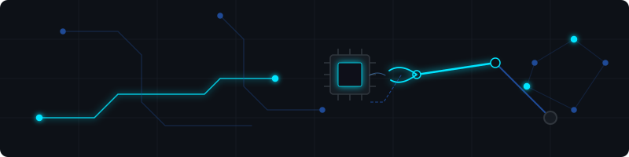
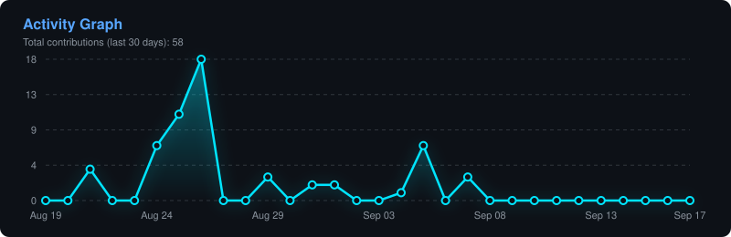

# SAILAKSHMI B T (`@Saibts`)
### Robotics & Automation Undergrad | Embedded Systems & AI Developer

  

 

  

 

> **Bonjour!** I am Sailakshmi B T, a third-year Robotics and Automation Engineering student at Madras Institute of Technology. I am passionate about embedded systems, control architectures, and integrating AI/computer vision with hardware.

---

## 🛠️ Tech Stack & Toolbox

  
<b>🤖 Robotics & Control Systems</b> (Click to expand)

   
  
  * **Frameworks & Middleware:** ROS 2 (Jazzy / Humble)
  * **Control & Kinematics:** Trajectory Planning, Feedback Loops, Motor Control
  * **Platforms:** AgileX Scout Mini, Mobile Robots, Robotic Arms
  * **Hardware Integration:** Sensors integration (LIDAR, IMUs, Encoders), Actuators

  
<b>👁️ Computer Vision & Machine Learning</b> (Click to expand)

   
  
  * **Computer Vision:** OpenCV, MediaPipe (Real-time Hand/Pose Tracking)
  * **Deep Learning & ML:** PyTorch, TensorFlow, Scikit-learn, Regression & Classification
  * **AI & Agentic Development:** AI Agents, Vibe Coding, LLM orchestration (Llama 3.2, Ollama), Local AI deployment

  
<b>💻 Software & Embedded Development</b> (Click to expand)

   
  
  * **Programming Languages:** Python, Embedded C
  * **Embedded Hardware:** Arduino, ESP32, STM32, Single Board Computers (Jetson)
  * **Tools & OS:** Git, Linux (Ubuntu), Micro-ROS, VS Code

---

## 🏗️ Featured Repositories

  
<b>🚀 AI & Control Projects</b> (Click to collapse/expand)

   

  * **🤖 [orion-local-ai](https://github.com/Saibts/orion-local-ai)**
    * Asynchronous voice assistant powered by Llama 3.2 running locally through Ollama, built with FastAPI, WebSockets, and Web Speech API.
  * **🤟 [sign-language-translator-cv](https://github.com/Saibts/sign-language-translator-cv)**
    * Computer Vision project implementing image processing and AI-based gesture classification for sign language translation.
  * **🚗 [autonomous-behavioral-cloning](https://github.com/Saibts/autonomous-behavioral-cloning)**
    * End-to-end deep learning model training a vehicle to drive autonomously in simulator environments using behavioral cloning.
  * **🖐️ [hand-gesture-controller-vol-bright](https://github.com/Saibts/hand-gesture-controller-vol-bright)**
    * Real-time webcam gesture controller utilizing OpenCV and MediaPipe to adjust system volume and brightness dynamically.
  * **📊 [concrete-strength-ml](https://github.com/Saibts/concrete-strength-ml)**
    * Machine learning analysis and regression models mapping raw material compositions to compressive concrete strength.
  * **🚜 [AgileX_ScoutMini_JAZZY](https://github.com/Saibts/AgileX_ScoutMini_JAZZY)**
    * Controls and integration driver setup targeting the AgileX Scout Mini mobile robot chassis.

---

## 📊 My Contribution Activity Graph

  
<b>📈 View Activity Insights</b> (Click to collapse/expand)

   

  

    
  

  
   
  
  

    
  

---

## 📬 Reach Out!
* 💼 **LinkedIn:** [linkedin.com/in/sailakshmi-65a696327](https://linkedin.com/in/sailakshmi-65a696327)
* 📧 **Email:** [sailakshmibt2006@gmail.com](mailto:sailakshmibt2006@gmail.com)
